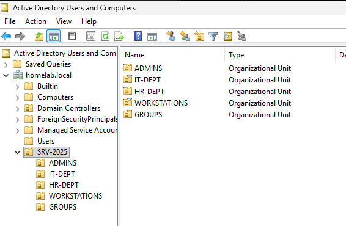
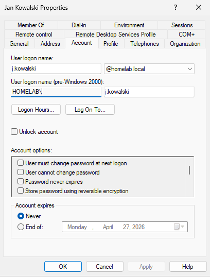

# Module 02: Active Directory Infrastructure & Identity Management

## Project Overview
The goal of this module was to design and implement a professional **Active Directory Domain Services (AD DS)** environment on Windows Server 2025 Datacenter. Moving away from a flat "default" structure, I implemented a hierarchical **Organizational Unit (OU)** model. This approach enables granular Group Policy (GPO) application, streamlined Role-Based Access Control (RBAC), and enhanced security management.

---

## Logical Architecture (OU Structure)
The structure was designed to reflect a real-world corporate environment, ensuring a clear separation between administrative assets and standard end-user objects.

```text
[HOMELAB.LOCAL] (Root)
└── 📂 SRV-2025 (Main Container)
    ├── 📂 ADMINS (Tier 0 - High-Privileged Accounts)
    ├── 📂 IT-DEPT (Technical Staff - Helpdesk & Admins)
    ├── 📂 HR-DEPT (Standard Users - High-Risk Phishing Group)
    ├── 📂 WORKSTATIONS (Computer Objects for Client Machines)
    └── 📂 GROUPS (Security & Distribution Groups)
```

## Key Implementation Features

### **1. Protection from Accidental Deletion**
To ensure high availability and prevent administrative errors, all critical OUs were hardened using the **Accidental Deletion Protection** flag. This prevents unauthorized or accidental modification of the directory tree.

### **2. RBAC (Role-Based Access Control)**
The directory was designed from the ground up to support **RBAC**. By separating users into functional OUs (HR, IT, Admins), I established a framework where permissions are delegated based on job functions rather than individual user accounts, simplifying audits and security.

### **3. Tiered Administration Readiness**
Following modern security best practices (Microsoft Tier Model), I separated **Administrative Accounts (Tier 0)** from daily productivity accounts. This strategy is vital for mitigating **Lateral Movement** risks during a potential network breach.

## 👤 Identity Management Standards
Consistency is key for IT automation and directory clarity. I implemented a strict **Naming Convention** standard for all objects within the domain.

| Attribute | Standard | Example |
| :--- | :--- | :--- |
| **User Logon Name** | `initial.surname` | `j.kowalski` |
| **Display Name** | `First Last` | `Jan Kowalski` |
| **Security Groups** | `GRP-[Dept]-[Function]` | `GRP-IT-Admins` |

---

## Implementation Evidence (Screenshots)

### 1. Active Directory OU Tree View
*Visual proof of the organized department-based structure.*
> 

### 2. Standardized User Configuration
*Demonstrating the 'initial.surname' naming convention in practice.*
> 

---

## Tech Stack & Tools
* **Operating System:** Windows Server 2025 Datacenter (Domain Controller)
* **Role:** AD DS (Active Directory Domain Services), DNS
* **Tools:** ADUC (Active Directory Users and Computers), RSAT (Remote Server Administration Tools)

---